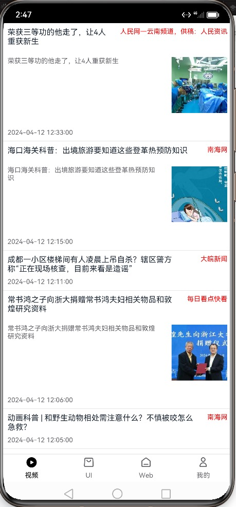
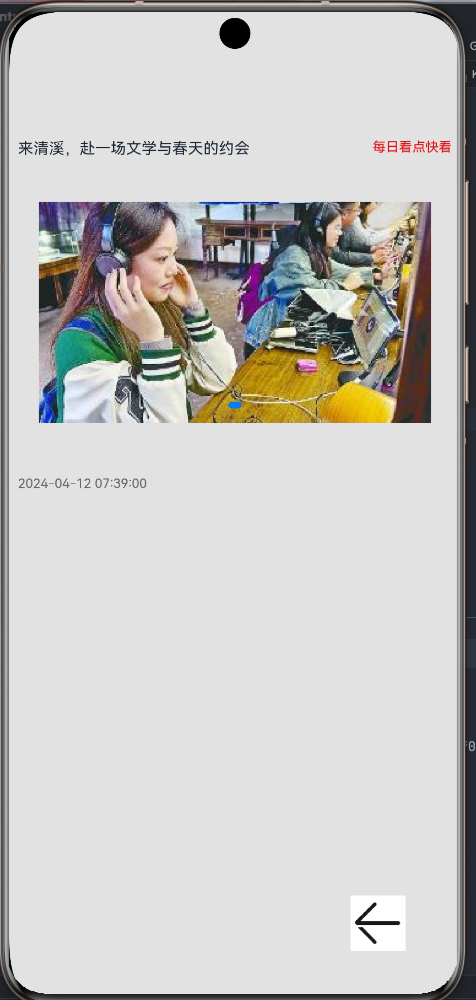

# HomeworkDemo
鸿蒙学习 demo, 高级开发者认证作业

作业旨在实操

## 作业1 
要求:
1. 创建一个支持 4 个 tab的页面
2. 完成第一个 tab, 其他先空着
3. 页面大致如下面截图

示例参考截图如下:




功能点:
3.1 构建 列表 UI, 不要求完全一样, 学习构建 ui 即可
3.2 网络请求数据, 支持上拉加载,下拉刷新 (引用第三方库实现即可)
3.3 缓存历史数据, 每次打开 app 先显示历史缓存,获取到新数据后刷新
3.4 点击一行打开对应详情页, 用基础 ui 写一个详情页, 全屏展示, 返回退出全屏

资料:
可以使用聚合数据的, 但是需要注册账号和实名认证
api详情: https://www.juhe.cn/docs/api/id/235
可以寻找其他免费的, 比如这个平台 https://www.free-api.com

#### 一些资源
几个色值:

```
 {
      "name": "white", // 背景色
      "value": "#FFFFFF"
    },
    {
      "name": "tab_separate_color",  // 分割线
      "value": "#E7E7E7"
    },
    {
      "name": "tab_normal_color", // tab 的 title 默认颜色
      "value": "#66666A"
    },
    {
      "name": "tab_selected_color", // tab 的 title 选中颜色
      "value": "#000000"
    }
```

icon 资源见icons文件夹

#### 一些说明
因为目前大家还都只能使用  api9, 所以使用第三方库依赖 如果调不通, 记得去看一下三方库的 readme 和 issue
有的库支持了 api10或者更高, 有不兼容的问题, api 需要使用指定版本
